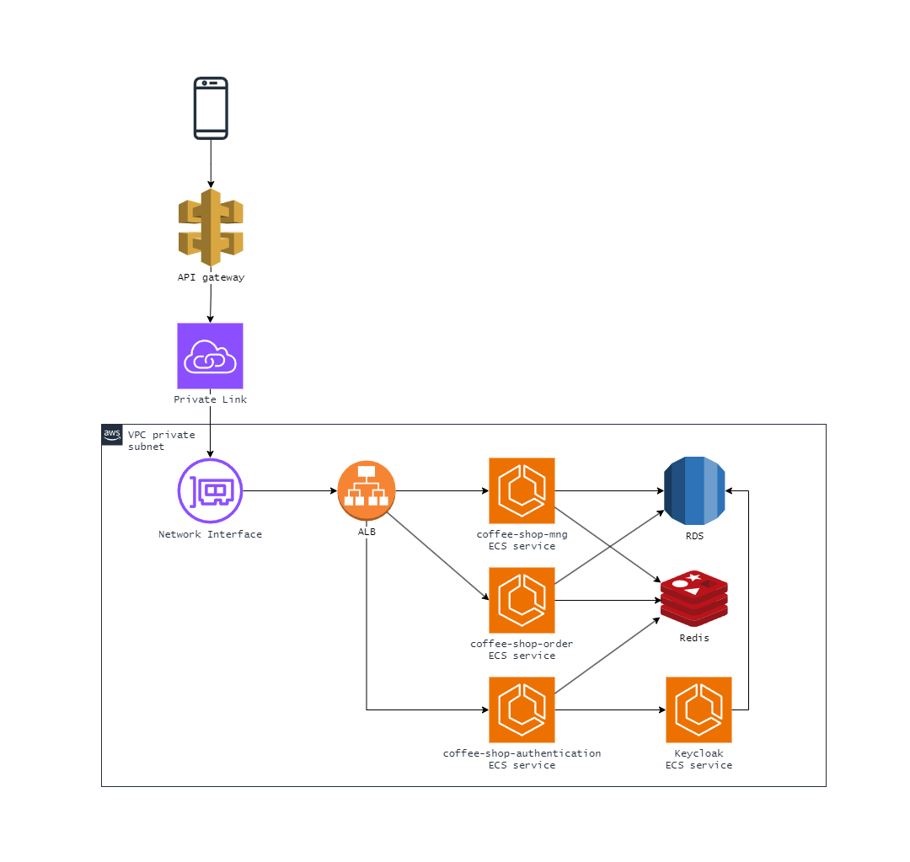
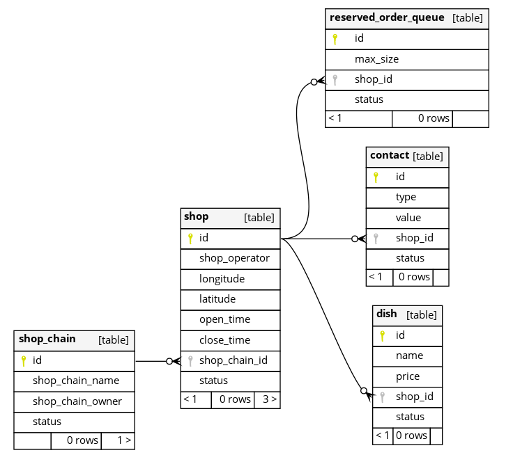
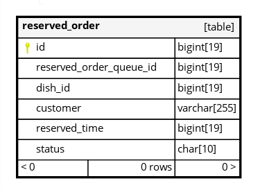
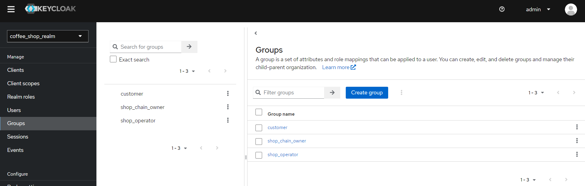
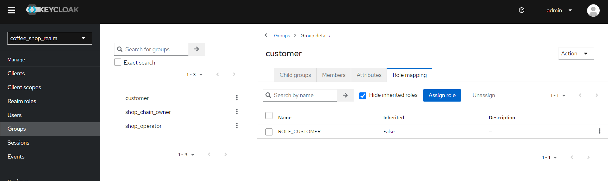
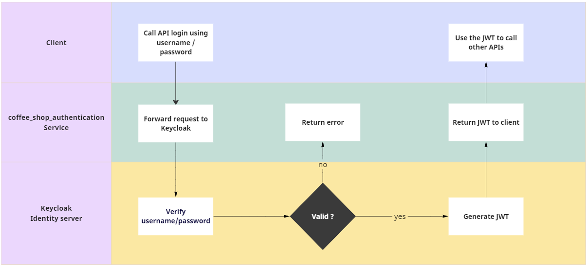
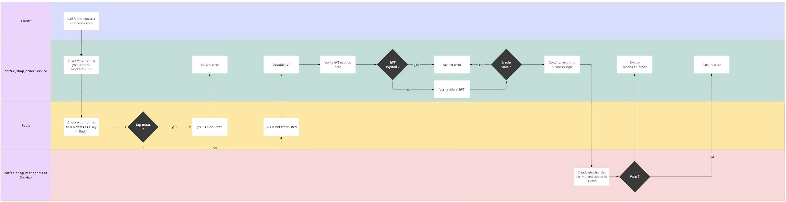
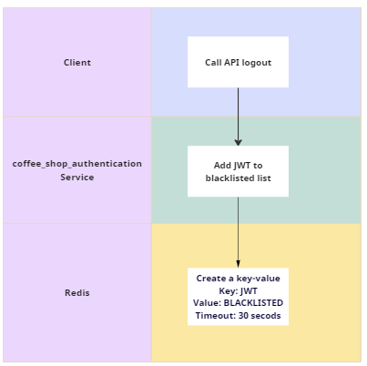
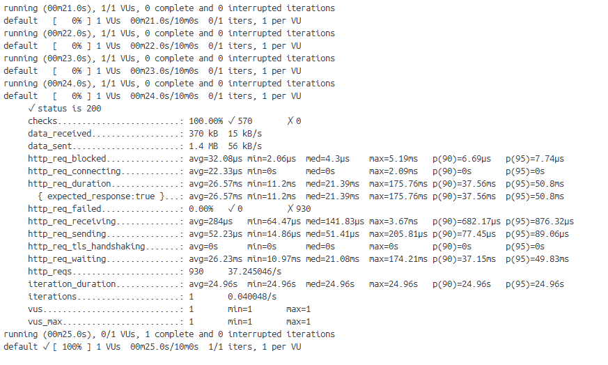

# Table of contents
1. [Requirements](#requirements)
    1. [The coffee shop app](#requirement_coffee_shop_app)
    2. [The customer app](#requirement_customer_app)
2. [Architecture](#architecture)
    1. [Architecture overview](#architecture_overview)
    2. [Architecture in AWS](#architecture_aws)
    3. [Data storage](#data_storage)
        1. [Database](#database)
        1. [Keycloak](#keycloak_storage)
3. [Some main flows](#main_flows)
    1. [Login](#login)
    2. [Make a order](#create_order)
    3. [Logout](#logout)
4. [Running and testing](#run_and_test)
    1. [Run the entire stack using Docker compose](#run)
    2. [Testing using K6](#test_k6)
    3. [Testing using Postman](#test_postman)

# Requirements <a name="requirements"></a>
A global coffee shop chain / franchise intends to launch an app to allow their regular customers to pre-order coffee to pick up (say, on their way to work). Below are the requirements for the mobile apps:

## The coffee shop app <a name="requirement_coffee_shop_app"></a>
* Allows the shop owner to login as an admin user
* Allows the shop owner to setup / configure the app to support their shop
* Allows the shop owner to configure the shop / app as follows:
    * Location and Contact details
    * The coffee menu & pricing
    * Number of queues and the maximum size of the queue
    * opening / closing times
* Allows the shop operator to login and manage the queue
* To view / see the size of the queue and the number of waiting customers
* To easily view the orders placed by the customers in the queue
* The name of the persons in the queue
* A score indicating the number of times that customers has been served by the coffee shop chain
* Take a customer off the queue and service them

## The customer app <a name="requirement_customer_app"></a>
* Allows the customer to register with their mobile number, name and regular address
* Allows the customer to view and find the coffee shops closest to them
* Place an online order for a coffee from the menu
* See their position in the queue (and expected waiting time before collecting the coffee)
* Exit the queue at any time (and notify the shop to cancel the order)
&nbsp;  
&nbsp;  
&nbsp;  
# Architecture <a name="architecture"></a>

## Architecture overview <a name="architecture_overview"></a>
The application will consist of 4 main parts:
* **Keycloak** identity server : handle the authentication-authorization and new users' registration
* **Spring-boot** microservices to handle business:
    * The coffee_shop_management service: take care of the shops' information
    * The coffee_shop_order service: take care of everything related to the orders
* **MySQL** Database: there will be 1 database for each of the microservices, and there will be another one that acts as the storage of **Keycloak**, so there will be 3 databases in total:
    * The Keycloak db
    * The coffee_shop_management_db
    * The coffee_shop_order_db
* **Redis**: serves as a short-term storage for blacklisted JWTs, will be used when users log out

## How it would looks like when deployed to AWS <a name="architecture_aws"></a>


## Data storage <a name="data_storage"></a>

Base on the requirements above, we will have:
* 6 corresponding business entities for the application, the first 5 are stored in _coffee_shop_management_db_, while the last one is stored in _coffee_shop_order_db_
    * Shop-chain
    * Shop
    * Dish
    * Order-queue
    * Contact
    * Order
* 3 type of actors, the information of these actors is stored in the Keycloak identity server
    * Shop-chain owner
    * Shop operator
    * Customer

### Database <a name="database"></a>
Here are the tables with their relationship in the _coffee_shop_management_db_


And here are the table in the _coffee_shop_order_db_


### Keycloak <a name="keycloak_storage"></a>
The realm chosen for this application is named **_coffee_shop_realm_**  
&nbsp;  
In this realm, we will create 3 groups, one for each of the type of actors, each group will be assigned a role that will be attached to the JWT of the users when users login  
&nbsp;  

&nbsp;   


When a user register for a new account, he/she will be assigned into one of these groups. 
&nbsp;  
&nbsp;  
&nbsp;  
# Some main flows <a name="main_flows"></a>

### Login <a name="login"></a>


### Make an order <a name="create_order"></a>


### Logout <a name="logout"></a>

&nbsp;  
&nbsp;  
&nbsp;  
# Running and testing <a name="run_and_test"></a>

### Run the entire stack using Docker compose <a name="run"></a>
First, you will need to download and install [Docker compose](https://docs.docker.com/compose/install/)  
After finish installing Docker compose, you can run the stacks following these steps:
* From the project's root folder, run this command to bring up the MySQL database, Keycloak, Redis. The _coffee_sqlpad_ and _coffee_shop_redis_commander_ are optional as they are just the UI for MySQL and Redis. This step may take about 1-2 minutes.
```
docker compose up -d coffee_db coffee_sqlpad coffee_keycloak coffee_shop_redis coffee_shop_redis_commander
```
* Wait till MySQL, Keycloak and Redis are all started and running, then you can continue with the microservices, this step may take about 4-5 minutes for the first time because Docker will need to download all the Maven dependency to build the images
```
docker compose up --build -d coffee_shop_management_svc coffee_shop_authentication_svc coffee_shop_order_svc
```
* (Optional) You can uncomment the schemaspy services in the file _docker-compose.yml_ and run those services using the following command to take a look at the entire structure of the 2 MySQL databases. The output can be viewed by opening these 2 files:
    *   _schemaspy\output\coffee_shop_management_db\index.html_
    *   _schemaspy\output\coffee_shop_order_db\index.html_
```
docker compose up -d coffee_shop_schemaspy_coffee_shop_management_db coffee_shop_schemaspy_coffee_shop_order_db
```

### Testing using K6 <a name="test_k6"></a>
After all the services are up and running, you can start to do some load-testing using K6. The testing with default config can be done using the following command:
```
docker compose up -d coffee_shop_loadtest_k6
```
If you want to modify the running config, you can modify this file _k6\loadtest.js_.  
The config is under the parts commented as 
```
// random config for running test
const numberOfShopChainOwner = 2;
const numberOfShopChainPerOwner = 3;
const numberOfShopPerShopChain = 3;
const numberOfDishPerShop = 4;
const numberOfQueuePerShop = 2;
const numberOfContactPerShop = 2;
const maxQueueSize = 100;

const numberOfCustomer = 10;
const numberOfOrderCreatedPerCustomerPerShop = 2;
```

After running the test, the result of the load test is logged in the container, so you can also exec into the container to see the result, the result would look like this:  
&nbsp;  


### Testing using Postman <a name="test_postman"></a>
Alternatively, you can do the testing using the following Postman collection and environment located in folder _postman_  
After importing those 2 files into Postman, you can start by registering some users and calling the APIs to test the business functions